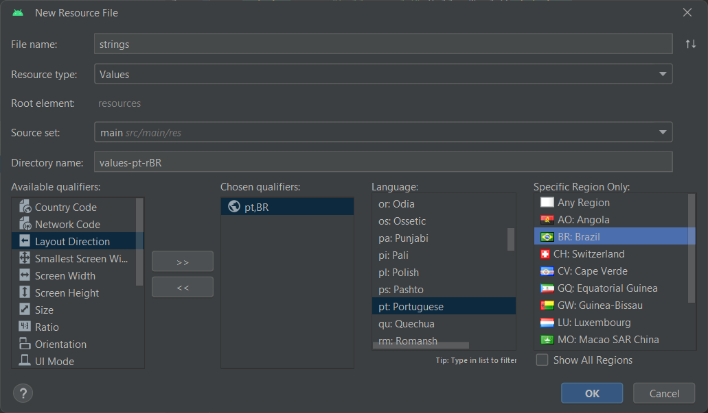

# Internacionalização no Android com Jetpack Compose

## 1. Definindo Strings em Inglês

Primeiro, vamos definir as strings do nosso aplicativo em inglês. Isso é feito no arquivo de recursos `strings.xml` localizado em `res/values`. Aqui está um exemplo:

```xml
<!-- res/values/strings.xml -->

<resources>
    <string name="app_name">MediaPickerSuite</string>
    <string name="hello_world">Hello World!</string>
    <string name="change_language">Change Language</string>
</resources>
```

## 2. Adicionando Suporte para Português Brasileiro

Agora, vamos adicionar suporte para Português Brasileiro. Para isso, precisamos criar um novo arquivo `strings.xml` em um diretório específico para o idioma português brasileiro (`values-pt-rBR`). Siga estas etapas no Android Studio:

- No painel do projeto, clique com o botão direito do mouse no diretório `res`.
- Selecione `New` e depois `Android Resource File`.
- Nomeie o arquivo como “strings” e selecione o tipo de recurso como “Values”.
- Escolha um elemento raiz, por exemplo, “resources”.
- No campo “Directory name”, insira `values-pt-rBR` para especificar que este arquivo de recursos é para o idioma português brasileiro.
- Clique em `OK` para criar o arquivo.



Inserindo a tradução das `strings` da aplicação:

```xml
<!-- res/values-pt-rBR/strings.xml -->

<?xml version="1.0" encoding="utf-8"?>
<resources>
    <string name="app_name">MediaPickerSuite</string>
    <string name="hello_world">Olá Mundo!</string>
    <string name="change_language">Selecione o idioma</string>
</resources>
```

## 3. Gerenciando as Preferências de Idioma

A classe `LanguagePreferences` é responsável por salvar e recuperar o idioma selecionado pelo usuário. Ela usa o `SharedPreferences` para armazenar o idioma atual. A função `saveLanguage` salva o idioma selecionado e a propriedade `language` recupera o idioma salvo.

```kotlin
class LanguagePreferences(context: Context){
    private val sharedPreferences = context.getSharedPreferences(
        "language_prefs",
        Context.MODE_PRIVATE
    )

    fun saveLanguage(language: Language){
        sharedPreferences.edit()
            .putString("language", language.name)
            .apply()
    }

    val language: Language?
        get() {
            val languageCode = sharedPreferences.getString("language", null)
            return Language.values().find { it.name == languageCode }
        }
}
```

## 4. Gerenciando o Idioma

A classe `LanguageManager` é responsável por gerenciar o idioma atual do aplicativo. Ela usa a classe `LanguagePreferences` para salvar e recuperar o idioma. A função `updateResources` é usada para atualizar os recursos do aplicativo para o idioma selecionado.

```kotlin
class LanguageManager(private val context: Context) {
    private val languagePreferences = LanguagePreferences(context)

    var currentLanguage: Language
        get() = languagePreferences.language ?: Language.EN_US
        set(value) {
            languagePreferences.saveLanguage(value)
        }

    fun updateResources(locale: Locale): Context{
        val config = Configuration(context.resources.configuration)
        config.setLocale(locale)
        return context.createConfigurationContext(config)
    }
}
```

## 5. Definindo os Idiomas Suportados

A enumeração `Language` define os idiomas suportados pelo aplicativo. Cada idioma é associado a um `Locale` específico.

```kotlin
enum class Language(val locale: Locale) {
    PT_BR(Locale("pt", "BR")),
    EN_US(Locale("en", "US"))
}
```

## 6. Criando o Conteúdo Localizado

O composable `LocalizedContent` é usado para criar conteúdo que é localizado para o idioma atual. Ele usa o `LanguageManager` para obter o idioma atual e atualiza os recursos do aplicativo para esse idioma.

```kotlin
@Composable
fun LocalizedContent(
    content: @Composable () -> Unit
){
    val context = LocalContext.current
    val languageManager = remember {
        LanguageManager(context)
    }
    val currentLanguage = remember {
        mutableStateOf(languageManager.currentLanguage)
    }

    LaunchedEffect(Unit){
        currentLanguage.value = languageManager.currentLanguage
    }
    CompositionLocalProvider(LocalLanguageManager provides languageManager) {
        CompositionLocalProvider(
            LocalContext provides languageManager
                .updateResources(currentLanguage.value.locale)
        ) {
            content()
        }
    }
}
```

## 7. Selecionando o Idioma

O composable `LanguageSelector` permite ao usuário selecionar o idioma. Ele exibe um menu suspenso com os idiomas disponíveis. Quando o usuário seleciona um idioma, o idioma atual é atualizado e o aplicativo é reiniciado para aplicar o novo idioma.

```kotlin
@Composable
fun LanguageSelector(){
    val context = LocalContext.current
    val languageManager = remember { Injector.provideLanguageManager() }
    val currentLanguage = remember { mutableStateOf(languageManager.currentLanguage) }
    val expanded = remember { mutableStateOf(false) }

    Button(onClick = { expanded.value = true }) {
        Text(text = stringResource(id = R.string.change_language))
    }

    DropdownMenu(
        expanded = expanded.value,
        onDismissRequest = { expanded.value = false }
    ) {
        Language.values().forEach { language ->
            DropdownMenuItem(
                text = {
                       Text(text = language.name)
                },
                onClick = {
                    if(language == currentLanguage.value)
                        return@DropdownMenuItem

                    currentLanguage.value = language
                    languageManager.currentLanguage = language
                    expanded.value = false

                    restartActivity(context)
                }
            )
        }
    }
}

private fun restartActivity(context: Context){
    val activityManager = ContextCompat
        .getSystemService(context, ActivityManager::class.java)

    val appTasks = activityManager?.appTasks

    appTasks?.get(0)?.finishAndRemoveTask()
    appTasks?.get(0)?.startActivity(
        context,
        context.packageManager
            .getLaunchIntentForPackage(
                context.packageName
            ),
        null
    )
}
```

# ViewModel

```
class MainActivity : ComponentActivity() {
    override fun onCreate(savedInstanceState: Bundle?) {
        super.onCreate(savedInstanceState)
        setContent {
            SofiaTheme {
                // A surface container using the 'background' color from the theme
                Surface(
                    modifier = Modifier.fillMaxSize(),
                    color = MaterialTheme.colorScheme.background
                ){
                    val pvm: PatientViewModel = viewModel()
                    FormScreen(pvm)
                }
            }
        }
    }
}

@Composable
fun FormScreen(pvm: PatientViewModel){
    var step by remember {
        mutableStateOf(1)
    }

    Column {
        when(step){
            1 -> FirstStageForm(pvm){
                step = 2
            }
            2 -> SecondStageForm(pvm){
                step = 1
            }
        }
    }
}

@Composable
fun FirstStageForm(
    pvm: PatientViewModel,
    onContinue: () -> Unit
){
    val patientState by pvm.patientState.collectAsState()

    Column{
        Spacer(modifier = Modifier.height(10.dp))

        FormField(
            label = "FirstName",
            stateFlow = patientState.firstName,
            onValueChange = {
                patientState.updateFirstName(it)
            }
        )

        Button(onClick = onContinue) {
            Text(text = "Próximo")
        }
    }
}

@Composable
fun SecondStageForm(
    pvm: PatientViewModel,
    onBack: () -> Unit
){
    val guardianState by pvm.guardianState.collectAsState()

    Column {
        Spacer(modifier = Modifier.height(10.dp))

        FormField(
            label = "FirstName",
            stateFlow = guardianState.firstName,
            onValueChange = {
                guardianState.updateFirstName(it)
            }
        )

        Button(onClick = onBack) {
            Text(text = "Voltar")
        }
    }
}

@OptIn(ExperimentalMaterial3Api::class)
@Composable
fun FormField(
    label: String,
    stateFlow: StateFlow<String>,
    onValueChange: (String) -> Unit
){
    val value by stateFlow.collectAsState()

    OutlinedTextField(
        label = { Text(label) },
        value = value,
        onValueChange = onValueChange
    )
}
```

# Navigation Graph
```Gradle
# build.gradle.kts (Module :app)

dependencies {
// Navigation
    implementation("androidx.navigation:navigation-compose:2.8.0-alpha05")
}
```

# NavGraph
# Autenticação

## Importações:

```gradle
    // EncryptedSharedPreferences
    implementation("androidx.security:security-crypto:1.1.0-alpha03")

    // Retrofit
    implementation("com.squareup.retrofit2:retrofit:2.9.0")
    implementation("com.squareup.retrofit2:converter-gson:2.9.0")
```

xml -> new file -> network-security-config.xml:
```xml
<network-security-config>
    <domain-config cleartextTrafficPermitted="true">
        <domain includeSubdomains="true">10.0.2.2</domain>
        <trust-anchors>
            <certificates src="@raw/my_cert"/>
        </trust-anchors>
    </domain-config>
</network-security-config>
```

adicionar ao manifests/AndroidManifests.xml:
```xml
<?xml version="1.0" encoding="utf-8"?>
<manifest xmlns:android="http://schemas.android.com/apk/res/android"
    xmlns:tools="http://schemas.android.com/tools">

    <!-- Adicionar esta linha de permissão de acesso a Internet -->
    <uses-permission android:name="android.permission.INTERNET" />
    
    <application
        ...
        android:networkSecurityConfig="@xml/network_security_config"
        ...
    </application>
</manifest>
```